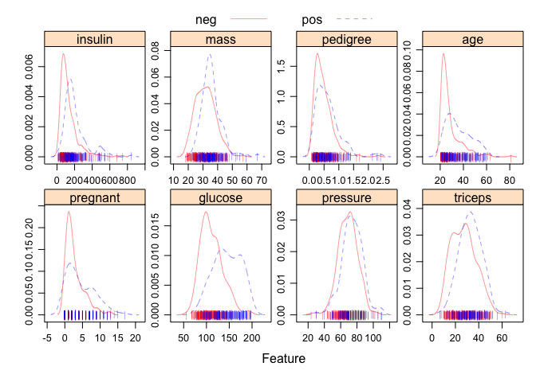

Classification I
================
Lin Yang

``` r
library(caret)
library(glmnet)
library(mlbench)
library(pROC)
library(pdp)
library(vip)
library(AppliedPredictiveModeling)
```

## Dataset

``` r
data(PimaIndiansDiabetes2)
dat <- na.omit(PimaIndiansDiabetes2)

theme1 <- transparentTheme(trans = 0.4)
trellis.par.set(theme1)

featurePlot(x = dat[, 1:8],
            y = dat$diabetes,
            scales = list(x = list(relation = "free"),
                          y = list(relation = "free")),
            plot = "density", pch = "|",
            auto.key = list(columns = 2))
```

<!-- -->

## Divide data into training and test sets

``` r
set.seed(1)
rowTrain <- createDataPartition(y = dat$diabetes,
                                p = 0.75,
                                list = FALSE)
```

## Logistic regression and its cousins

### use `glm`

``` r
contrasts(dat$diabetes)
```

    ##     pos
    ## neg   0
    ## pos   1

``` r
glm.fit <- glm(diabetes ~ .,
               data = dat,
               subset = rowTrain,
               family = binomial(link = "logit"))

summary(glm.fit)
```

    ## 
    ## Call:
    ## glm(formula = diabetes ~ ., family = binomial(link = "logit"), 
    ##     data = dat, subset = rowTrain)
    ## 
    ## Deviance Residuals: 
    ##     Min       1Q   Median       3Q      Max  
    ## -2.8426  -0.7118  -0.3970   0.6963   2.4158  
    ## 
    ## Coefficients:
    ##               Estimate Std. Error z value Pr(>|z|)    
    ## (Intercept) -8.6375872  1.3353227  -6.469 9.90e-11 ***
    ## pregnant     0.1062499  0.0636546   1.669   0.0951 .  
    ## glucose      0.0355063  0.0065385   5.430 5.63e-08 ***
    ## pressure    -0.0086717  0.0130557  -0.664   0.5066    
    ## triceps      0.0203593  0.0184871   1.101   0.2708    
    ## insulin     -0.0003983  0.0014435  -0.276   0.7826    
    ## mass         0.0507929  0.0311642   1.630   0.1031    
    ## pedigree     1.1693193  0.4627894   2.527   0.0115 *  
    ## age          0.0245899  0.0215884   1.139   0.2547    
    ## ---
    ## Signif. codes:  0 '***' 0.001 '**' 0.01 '*' 0.05 '.' 0.1 ' ' 1
    ## 
    ## (Dispersion parameter for binomial family taken to be 1)
    ## 
    ##     Null deviance: 375.08  on 294  degrees of freedom
    ## Residual deviance: 270.87  on 286  degrees of freedom
    ## AIC: 288.87
    ## 
    ## Number of Fisher Scoring iterations: 5

### 2X2 contingency table

``` r
test.pred.prob <- predict(glm.fit, newdata = dat[-rowTrain,],
                          type = "response")
test.pred <- rep("neg", length(test.pred.prob))
test.pred[test.pred.prob > 0.5] <- "pos"
test.pred
```

    ##  [1] "pos" "neg" "neg" "pos" "neg" "neg" "neg" "neg" "pos" "neg" "neg" "neg"
    ## [13] "neg" "neg" "neg" "pos" "pos" "neg" "pos" "neg" "neg" "neg" "neg" "pos"
    ## [25] "neg" "neg" "neg" "neg" "pos" "pos" "neg" "neg" "pos" "neg" "pos" "neg"
    ## [37] "neg" "neg" "neg" "neg" "neg" "neg" "neg" "neg" "neg" "pos" "pos" "neg"
    ## [49] "neg" "neg" "neg" "neg" "neg" "neg" "neg" "pos" "neg" "pos" "neg" "neg"
    ## [61] "pos" "pos" "neg" "pos" "neg" "pos" "pos" "neg" "neg" "pos" "neg" "pos"
    ## [73] "neg" "neg" "neg" "pos" "neg" "neg" "neg" "neg" "neg" "pos" "neg" "neg"
    ## [85] "neg" "neg" "pos" "neg" "neg" "neg" "neg" "neg" "pos" "neg" "neg" "neg"
    ## [97] "neg"

``` r
confusionMatrix(data = as.factor(test.pred),
                reference = dat$diabetes[-rowTrain],
                positive = "pos")
```

    ## Confusion Matrix and Statistics
    ## 
    ##           Reference
    ## Prediction neg pos
    ##        neg  60  11
    ##        pos   5  21
    ##                                          
    ##                Accuracy : 0.8351         
    ##                  95% CI : (0.746, 0.9027)
    ##     No Information Rate : 0.6701         
    ##     P-Value [Acc > NIR] : 0.0002081      
    ##                                          
    ##                   Kappa : 0.6083         
    ##                                          
    ##  Mcnemar's Test P-Value : 0.2112995      
    ##                                          
    ##             Sensitivity : 0.6562         
    ##             Specificity : 0.9231         
    ##          Pos Pred Value : 0.8077         
    ##          Neg Pred Value : 0.8451         
    ##              Prevalence : 0.3299         
    ##          Detection Rate : 0.2165         
    ##    Detection Prevalence : 0.2680         
    ##       Balanced Accuracy : 0.7897         
    ##                                          
    ##        'Positive' Class : pos            
    ## 

### ROC curve

``` r
roc.glm <- roc(dat$diabetes[-rowTrain], test.pred.prob)
plot(roc.glm, legacy.axes = TRUE, print.auc = TRUE)
plot(smooth(roc.glm), col = 4, add = TRUE)
```

<!-- -->

### Use `caret` to compare CV performance with other models

``` r
ctrl <- trainControl(method = "repeatedcv",
                     summaryFunction = twoClassSummary,
                     classProbs = TRUE)
set.seed(1)
model.glm <- train(x = dat[rowTrain, 1:8],
                   y = dat$diabetes[rowTrain],
                   method = "glm",
                   metric = "ROC",
                   trControl = ctrl)
```

## Penalized logistic regression

``` r
glmnGrid <- expand.grid(.alpha = seq(0, 1, length = 21),
                        .lambda = exp(seq(-8, -1, length = 50)))
set.seed(1)
model.glmn <- train(x = dat[rowTrain, 1:8],
                    y = dat$diabetes[rowTrain],
                    method = "glmnet",
                    tuneGrid = glmnGrid,
                    metric = "ROC",
                    trControl = ctrl)
model.glmn$bestTune
```

    ##    alpha    lambda
    ## 93  0.05 0.1353353

``` r
myCol <- rainbow(25)
myPar <- list(superpose.symbol = list(col = myCol),
              superpose.line = list(col = myCol))

plot(model.glmn, par.settings = myPar, xTrans = function(x) log(x))
```

<!-- -->

## GAM model

``` r
set.seed(1)
model.gam <- train(x = dat[rowTrain, 1:8],
                   y = dat$diabetes[rowTrain],
                   method = "gam",
                   metric = "ROC",
                   trControl = ctrl)

model.gam$finalModel
```

    ## 
    ## Family: binomial 
    ## Link function: logit 
    ## 
    ## Formula:
    ## .outcome ~ s(pregnant) + s(pressure) + s(age) + s(triceps) + 
    ##     s(glucose) + s(insulin) + s(mass) + s(pedigree)
    ## 
    ## Estimated degrees of freedom:
    ## 0.0001 0.0000 7.5614 1.3490 2.2830 0.0000 0.0000 
    ## 1.6659  total = 13.86 
    ## 
    ## UBRE score: -0.0602217

``` r
plot(model.gam$finalModel, select = 3)
```

<!-- -->

## MARS model

``` r
set.seed(1)
model.mars <- train(x = dat[rowTrain, 1:8],
                    y = dat$diabetes[rowTrain],
                    method = "earth",
                    tuneGrid = expand.grid(degree = 1:4,
                                           nprune = 2:20),
                    metric = "ROC",
                    trControl = ctrl)

plot(model.mars)
```

<!-- -->

``` r
coef(model.mars$finalModel)
```

    ##       (Intercept)    h(glucose-117)         h(29-age) h(1.258-pedigree) 
    ##        0.47846627        0.04364894       -0.21648937       -1.34468216 
    ##     h(37-triceps) 
    ##       -0.04894219

``` r
pdp::partial(model.mars, pred.var = c("age"), grid.resolution = 200) %>% autoplot()
```

<!-- -->

``` r
vip(model.mars$finalModel)
```

<!-- -->

## Compare models

``` r
res <- resamples(list(GLM = model.glm,
                      GLMN = model.glmn,
                      GAM = model.gam,
                      MARS = model.mars))

summary(res)
```

    ## 
    ## Call:
    ## summary.resamples(object = res)
    ## 
    ## Models: GLM, GLMN, GAM, MARS 
    ## Number of resamples: 10 
    ## 
    ## ROC 
    ##       Min. 1st Qu. Median      Mean   3rd Qu.      Max. NA's
    ## GLM  0.760 0.79125 0.8175 0.8329971 0.8754386 0.9298246    0
    ## GLMN 0.755 0.80750 0.8275 0.8406813 0.8881579 0.9181287    0
    ## GAM  0.660 0.78625 0.8200 0.8174357 0.8412281 0.9210526    0
    ## MARS 0.705 0.76625 0.7950 0.8042836 0.8478070 0.8976608    0
    ## 
    ## Sens 
    ##      Min.   1st Qu.    Median      Mean   3rd Qu.      Max. NA's
    ## GLM  0.75 0.8500000 0.8947368 0.8686842 0.9000000 0.9473684    0
    ## GLMN 0.85 0.8625000 0.9000000 0.9092105 0.9473684 1.0000000    0
    ## GAM  0.75 0.8500000 0.9000000 0.8794737 0.9355263 1.0000000    0
    ## MARS 0.75 0.8421053 0.8500000 0.8531579 0.8875000 0.9473684    0
    ## 
    ## Spec 
    ##      Min.   1st Qu.    Median      Mean   3rd Qu.      Max. NA's
    ## GLM   0.3 0.4250000 0.5777778 0.5222222 0.6000000 0.7000000    0
    ## GLMN  0.3 0.3500000 0.5000000 0.4822222 0.5888889 0.6666667    0
    ## GAM   0.3 0.4250000 0.5500000 0.5766667 0.7000000 0.8888889    0
    ## MARS  0.2 0.4111111 0.5000000 0.5022222 0.6000000 0.7777778    0

``` r
bwplot(res, metric = "ROC")
```

<!-- -->

## Test data performance

``` r
glm.pred <- predict(model.glm, newdata = dat[-rowTrain,], type = "prob")[,2]
glmn.pred <- predict(model.glmn, newdata = dat[-rowTrain,], type = "prob")[,2]
gam.pred <- predict(model.gam, newdata = dat[-rowTrain,], type = "prob")[,2]
mars.pred <- predict(model.mars, newdata = dat[-rowTrain,], type = "prob")[,2]

roc.glm <- roc(dat$diabetes[-rowTrain], glm.pred)
roc.glmn <- roc(dat$diabetes[-rowTrain], glmn.pred)
roc.gam <- roc(dat$diabetes[-rowTrain], gam.pred)
roc.mars <- roc(dat$diabetes[-rowTrain], mars.pred)

auc <- c(roc.glm$auc[1], roc.glmn$auc[1], 
         roc.gam$auc[1], roc.mars$auc[1])

modelNames <- c("glm", "glmn", "gam", "mars")

ggroc(list(roc.glm, roc.glmn, roc.gam, roc.mars), legacy.axes = TRUE) + 
  scale_color_discrete(labels = paste0(modelNames, " (", round(auc,3),")"),
                       name = "Models (AUC)") +
  geom_abline(intercept = 0, slope = 1, color = "grey")
```

<!-- -->

``` r
## using plot.roc
plot(roc.glm, legacy.axes = TRUE)
plot(roc.glmn, col = 2, add = TRUE)
plot(roc.gam, col = 3, add = TRUE)
plot(roc.mars, col = 4, add = TRUE)

legend("bottomright", legend = paste0(modelNames, ": ", round(auc,3)),
       col = 1:4, lwd = 2)
```

<!-- -->
